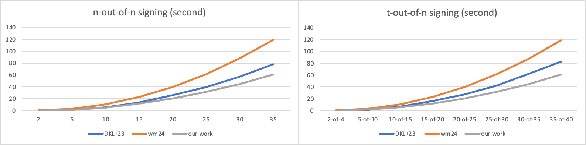
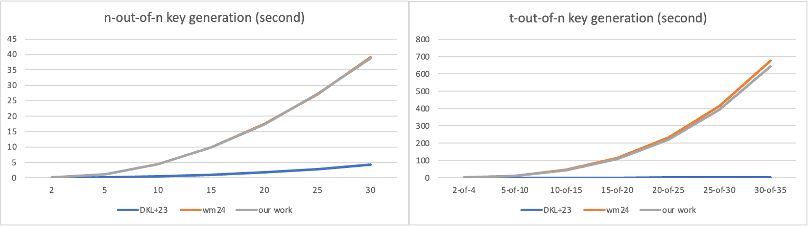
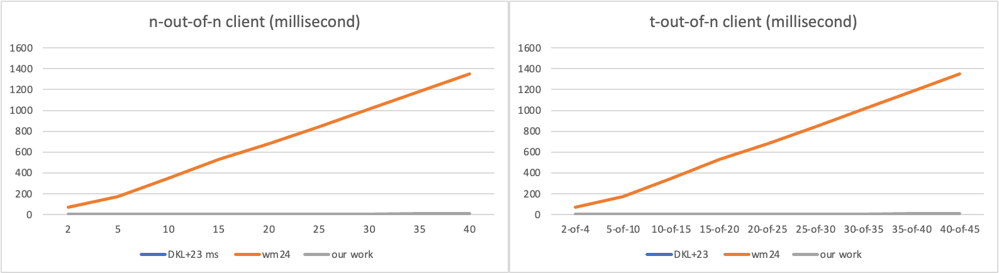

# Threshold BBS+
This repository provides the artifacts regarding our submission #1286, including the following,

**Implementation** 
We provide implementations of our scheme, SET-BBS+, and the state-of-the-art [WMC24](https://www.ndss-symposium.org/ndss-paper/secure-multiparty-computation-of-threshold-signatures-made-more-efficient/) for both n-out-of-n and t-out-of-n scenarios. Additionally, we have modified the open-source code of [DKL+23](https://eprint.iacr.org/2023/602) to support these scenarios as well. 

**Reproduction of Our Experiment Results** 
We provide the two methods for reproducing the performance comparison between our work and the state-of-the-art are provided in Tables 3 and 4 of our original submission. Two methods include the following:
* Using Docker to reproduce our results in few minutes without installing prerequisites.
* Configuring and deploying our code on Ubuntu and macOS

**Security Proof of $t$-out-of-$n$ with Weak Partial Blindness**
We provide the security proof in the style of DKL+23 of our protocol in the t-out-of-n setting with weak partial blindness at `security_proof.pdf`.

**Note** To quickly validate our results, we set the default number of parties to 10-out-of-10 for the n-out-of-n scenario in our benchmarks. Additionally, to demonstrate that our signing protocol performs equally well in the t-out-of-n scenario, we set the default to 10-out-of-15, ensuring the number of signing parties remains the same as in the n-out-of-n scenario. We also provide detailed instructions below for updating the number of parties in our benchmarks.
  
## Table of Contents
- [Threshold BBS+](#threshold-bbs)
  - [Table of Contents](#table-of-contents)
  - [Performance](#performance)
  - [Implementation](#implementation)
  - [Instructions for Reproduction](#instructions-for-reproduction)
    - [Depolyment via Docker](#depolyment-via-docker)
    - [Depolyment via Source Code](#depolyment-via-source-code)
      - [On Ubuntu 24.04.1](#on-ubuntu-24041)
      - [On macOS Sonoma 14.0](#on-macos-sonoma-140)
    - [Commands of Running Experiments](#commands-of-running-experiments)
      - [N-OUT-OF-N](#n-out-of-n)
      - [T-OUT-OF-N](#t-out-of-n)
  - [Instructions for Updating Number of Parties](#instructions-for-updating-number-of-parties)
  - [Discussion on Experiment Results](#discussion-on-experiment-results)
 
## Performance
We use the Rust benchmarking library `criterion`, which conducts multiple measurements and applies statistical analysis for robust results. This allows us to confidently report millisecond-level timings with high precision.




**Note** 
In DKL+23, their key generation process is much faster than ours since it is implemented as the trusted party key generation, which does not include the generation and verification of zero-knowledge proofs during this phase. The corresponding code is located in their repository at `crypto/bbs_plus/src/threshold/threshold_bbs_plus.rs#237` for n-out-of-n and at `crypto/bbs_plus/src/threshold/threshold_bbs_plus.rs#228` for t-out-of-n, respectively.
## Implementation
The code for the main protocols is located as follows:
  * `src/n_out_of_n/setbbsplus` n-out-of-n SET-BBS+ 
  * `src/t_out_of_n/setbbsplus` t-out-of-n SET-BBS+ 
  * `src/n_out_of_n/wmc24` n-out-of-n WMC24
  * `src/t_out_of_n/wmc24` t-out-of-n WMC24
  * `crypto/bbs_plus/src/threshold/threshold_bbs_plus.rs` n-out-of-n and t-out-of-n DKL+23
  
## Instructions for Reproduction

### Depolyment via Docker

1. Install Docker. Official guideline (https://docs.docker.com/get-started/get-docker/)
2. Pull our image.
    ```sh
        docker pull gypsophila661/tbbsplus:1.0
    ```
3. Run the container.     
    ```sh
        docker run -it gypsophila661/tbbsplus:1.0 /bin/bash
    ```
4. Open the project folder.
   ```sh
        cd ~/TBBSPlus/
   ```

### Depolyment via Source Code

#### On Ubuntu 24.04.1

1. Install prerequisites
    ```sh
        apt-get update  
        apt-get install -y git curl build-essential libclang-dev libgmp-dev libssl-dev python3
        curl --proto '=https' --tlsv1.2 -sSf https://sh.rustup.rs | sh
    ```
2. Clone the repository
   ```sh
        git clone https://github.com/anonymousacc292/TBBSPlus.git
   ```
3. Compile the `prime` submodule
    ```sh
        cd ~/TBBSPlus/prime/src/lib
        bash prime.sh
    ```
4. Compile the repository
    ```sh
        cd ~/TBBSPlus/
        cargo build
    ```
#### On macOS Sonoma 14.0
Steps 2, 3, and 4 are identical to the above.
1. Install prerequisite
    ```sh
        /bin/bash -c "$(curl -fsSL https://raw.githubusercontent.com/Homebrew/install/HEAD/install.sh)"
        brew install git curl llvm gmp openssl python
        curl --proto '=https' --tlsv1.2 -sSf https://sh.rustup.rs | sh
    ```
### Commands of Running Experiments
A quick method to evaluate the performance of the signing phase for SET-BBS+, the state-of-the-art WMC24, and DKL+23 in both n-out-of-n and t-out-of-n scenarios.

```sh
    cd ~/TBBSPlus/
    python3 fast_run.py
```
The detailed commands for running the experiments are as follows:
#### N-OUT-OF-N
*  The signing phase of SET-BBS+ and WMC24
    ```sh
    RUSTFLAGS="-Awarnings" cargo bench --bench n_out_of_n_sign
    ```
*  The key generation phase of SET-BBS+ and WMC24
    ```sh
    RUSTFLAGS="-Awarnings" cargo bench --bench n_out_of_n_keygen
    ```
*  The client phase of SET-BBS+ and WMC24
    ```sh
    RUSTFLAGS="-Awarnings" cargo bench --bench n_out_of_n_client
    ```
*  The signing, key generation phase and client phase of of DKL+23 
    ```sh
    cd crypto
    RUSTFLAGS="-Awarnings" cargo test --release --package bbs_plus --lib -- threshold::threshold_bbs_plus::tests::signing_n_out_of_n --exact --show-output 
    ```
#### T-OUT-OF-N
*  The signing phase of SET-BBS+ and WMC24
    ```sh
    RUSTFLAGS="-Awarnings" cargo bench --bench t_out_of_n_sign
    ```
*  The key generation phase of SET-BBS+ and WMC24
    ```sh
    RUSTFLAGS="-Awarnings" cargo bench --bench t_out_of_n_keygen
    ```
*  The client phase of SET-BBS+ and WMC24
    ```sh
    RUSTFLAGS="-Awarnings" cargo bench --bench t_out_of_n_client
    ```
*  The signing, key generation phase and client phase of of DKL+23. 
    ```sh
    cd crypto
    RUSTFLAGS="-Awarnings" cargo test --release --package bbs_plus --lib -- threshold::threshold_bbs_plus::tests::signing_t_out_of_n --exact --show-output 
    ```
## Instructions for Updating Number of Parties
Our benchmarks in the `benches` folder of our repository.
* For n-out-of-n, modify the benchmark file by changing 'let n = 10;' to 'let n = [any other number];'.
* For t-out-of-n, modify the benchmark file by changing 'let n = 15; let t = 10;' to 'let n = [any other number]; let t = [any other number];'.

##  Discussion on Experiment Results
* Performance may vary across different hardware, but our protocol consistently achieves similar efficiency improvements compared to other works.

* If the number of parties is the same in both n-out-of-n and t-out-of-n scenarios, the performance of our signing protocol remain similar in both situations.

* In our benchmarks, we present the computational cost of our protocol and the state-of-the-art, while omitting the communication cost. The communication cost can be directly calculated according to Section 5.1, Theoretical Complexity, in our original submission.
